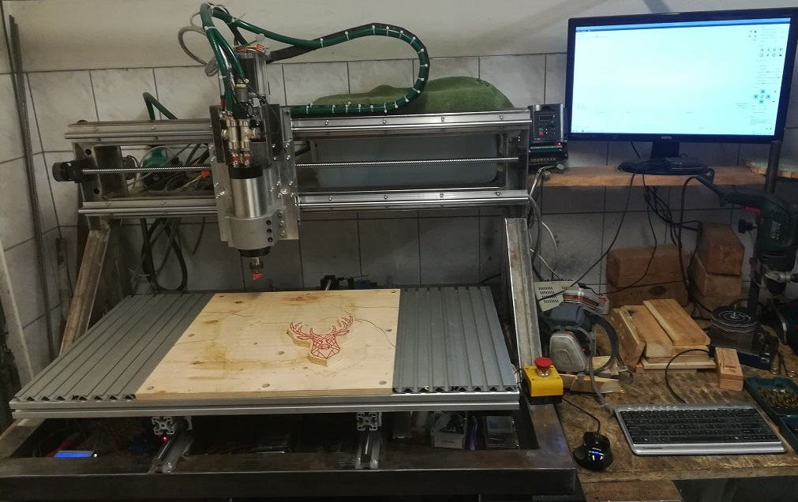

# CNC router/mill: electrical
The electrical part of the CNC router/mill project.

This repo contains the files needed for construction of a custom motion controller **based on the [GRBL 1.1](https://github.com/gnea/grbl) project**. If you don't want to make your own PCB you can use any GRBL-compatible motion controller - same basic principles of operation will apply.

## Table of contents

  * [Block diagram](#block-diagram)
  * [Motion controller](#motion-controller)
    + [Why not Arduino?](#why-not-arduino-)
    + [Detailed specification](#detailed-specification)
    + [GRBL Settings](#grbl-settings)
  * [Inputs wiring](#inputs-wiring)
    + [Limit switches](#limit-switches)
    + [Probe](#Probe)
    + [User buttons](#user-buttons)
  * [Motor Drivers](#motor-drivers)
    + [Driver configuration](#driver-configuration)
    + [Driver connection](#driver-connection)
  * [Inverter and Spindle](#inverter-and-spindle)
    + [Inverter connection](#inverter-connection)
    + [Spindle cooling](#spindle-cooling)
  * [Software for G-Code streaming](#software-for-g-code-streaming)
    + [Candle](#candle)
    + [GRBL Panel](#grbl-panel)

## Block diagram

## Motion controller

### Why not Arduino?
The main controller board is an AVR **ATmega8** based device aiming to replace the Arduino board as the motion controller. The reason why one might want to use this board instead of Arduino is that it provides:
* Galvanic insulation of the machine and the PC
* Robust power circuitry
* Robust, edge mounted connectors suitable for more "industrial" use
* Additional noise-reducing and LPF circuitry for the inputs and outputs
* A high-voltage output for the coolant valve relay

The Eagle project files are hosted in this repository along with the CAM configuration and its output (GERBER, drillfiles etc.) allowing for the easy PCB manufacturing/ordering.

In order to program a blank AVR chip with GRBL one needs first to obtain the Arduino bootloader allowing to update the frmware via the serial port from Arduino IDE.

### Detailed specification

* Up to 36V DC supply voltage when using **TSR 1-2450** DC-DC, otherwise **7805** linear regulator specification applies.
* Reverse power supply protection
* Reset switch
* ISP connector (*NOTE: Programming using ISP shlud not be conducted when the spindle inverter is connected.*)
* Debug serial commincation port with 5V tap
* USB to serial converter based on FTDI with optoisolation
* 3 sets of STEP/DIR/ENABLE connectors for stepper drivers with LED indicators
* User switches inputs (active low, with debouncing circuitry): ABORT, HOLD, START
* Probe input with debouncing circuitry and LED indication
* 3 limit switches inputs, active low, with debouncing circuitry and LED indication
* High voltage (supply), high current (1A) output for driving the coolant relay with Shottky protection (for the control of the tool cooling - rarely used for woodworking)
* PWM or analog (using LPF) 0-5V output for spindle speed and direction control with LED indication
* Simple and easy to hand-solder 100x50 mm two-layer board with 3mm holes in the corners for ease of mounting. 

### GRBL Settings
TODO: 

GRBL Settings

## Inputs wiring
### Limit switches
TODO:

Limit switches wiring

### Probe
TODO:

Probe wiring

### User buttons
TODO:

User Buttons wiring

## Motor Drivers

The **2DM556S** 4.2A RMS drivers are used.

### Driver configuration

* Current limiter on the driver is set to 3,31A in order to drive the **60HS100-3504A08-D24** 4,3N.m stepper motors. This is not the maximum current (3.5A) for the motors, but in order to keep them from overheating during some long sessions this needed to be lowered.
* Microstepping is set to "4000 Steps per revolution" accoding to the chineese maunfacturer. In real world combined with 1,8 sdegree mechanical resolution of the stepper and 5mm/turn of the ballscrew on each axis returns a resolution of 800 steps/mm. That means a theoretical resolution per step is 1.25 um which is absurd, yet it probably helps a bit with the smoothnes.
* Standby current is set, so when the motor is not in motion the current is lowered. This helps with overheating and I have not seen any adverse effects on the quality of the cuts.
* Smoothnes settings seem not to affect the operation nor the sound at all so I have turned it off. The speed ramps are calculated in the motion controller and they work OK. 

### Driver connection

The cabling connecting all the low-power signals from motion controller to the driver should be as short as possible. Shielding and grounding should be sound in order to avoid EMC interference with high-current lines. Pay special notice to the location of the inverter-to-spindle cable (which should be shielded in its own right) since it is the devil of such application. Calculate the correct cable diameters in order to reduce voltage drops on the high-current lines. 

The drivers heated up very slightly during prolonged operation, the passive cooling of their ribbed cases seems sufficient.

## Inverter and Spindle

A chineese set of inverter and spindle is used. The rated power of both is 2.2kW.

The inverter model is **YL620-A-2.2kW**. It is powered by a single-phase 230V mains.

### Inverter connection

TODO: 

Inverter Connection

### Spindle cooling

The spindle is water-cooled, so I made a temperature monitoring system from an old graphic-lcd project based on another AVR and here is what it does:
* measures the temperatures of the ingoing and outgoing coolant using **DS18B20** 1-wire digital thermometers
* measures the flow of the coolant using a simple **YF-S201** flow-meter
* calculates the thermal power gathered by the coolant
* displays calculated values live on the 128x64 LCD
* watches for ovearheat and low-flow conditions in order to alert the operator, pause the program and disable the spindle

## Software for G-Code streaming
### Candle
TODO:

Candle description

### GRBL Panel
TODO:

GRBL Panel description

